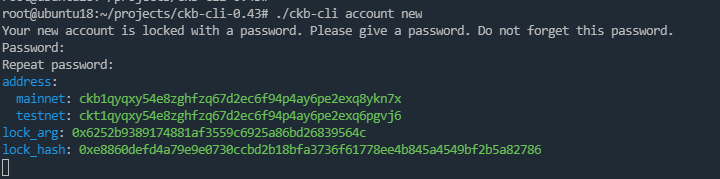
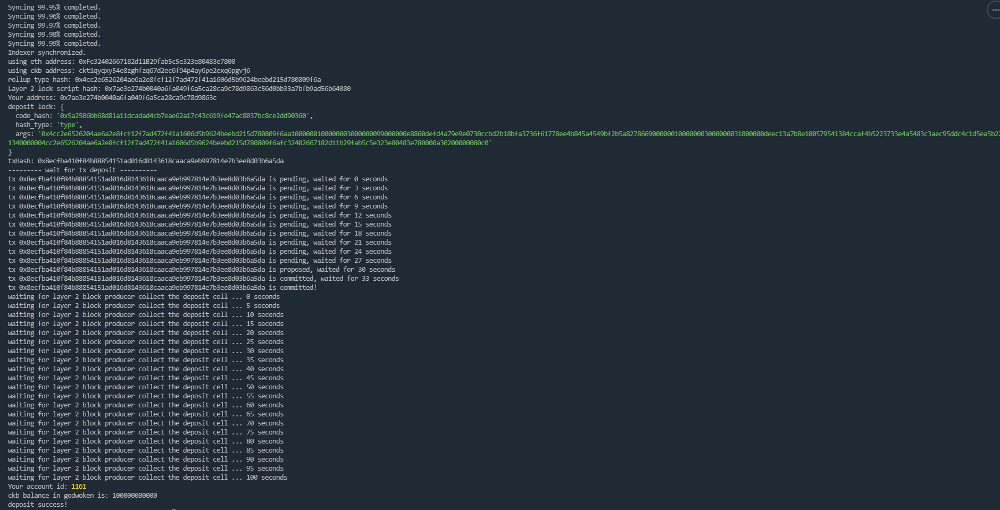

# Task 1: Create A Godwoken Account On The EVM Layer 2 Testnet

## 1.A screenshot of the accounts you created (account list) in ckb-cli.

ckt account: ckt1qyqx2h4e2stnxfawgfr5ue9jw75y4gcksessxavcsv

## 2.A link to the Layer 1 address you funded on the Testnet Explorer.

https://explorer.nervos.org/aggron/address/ckt1qyqxy54e8zghfzq67d2ec6f94p4ay6pe2exq6pgvj6

## 3.A screenshot of the console output immediately after you have successfully submitted a deposit to Layer 2.

