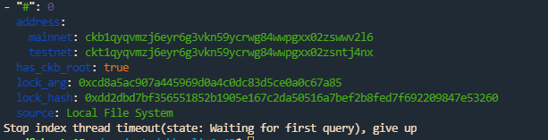
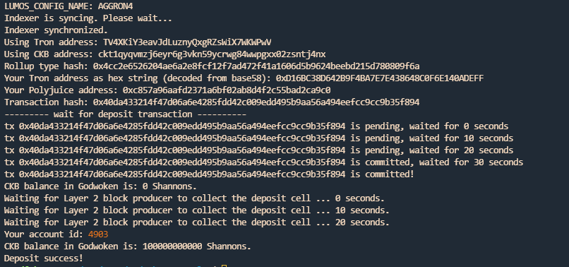
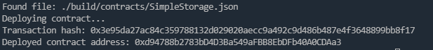
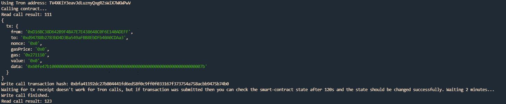

# Gitcoin: 10) Complete Withdrawal Process By Unlocking The Funds


## 1 A screenshot of the accounts you created (account list) in ckb-cli.



## 2 A link to the Layer 1 address you funded on the Testnet Explorer.

https://explorer.nervos.org/aggron/address/ckt1qyqvmzj6eyr6g3vkn59ycrwg84wwpgxx02zsntj4nx


## 3 A screenshot of the console output immediately after you have successfully submitted a CKByte deposit to your Tron account on Layer 2.



## 4 A screenshot of the console output immediately after you have successfully issued a smart contract calls on Layer 2.




## 5 The transaction hash of the "Contract call" from the console output (in text format).



## 6 The contract address that you called (in text format).


0xd94788b2783bD4D3Ba549aFBB8EbDFb40A0CDAa3

## 7 The ABI for contract you made a call on (in text format).


```
   [
    {
      "inputs": [],
      "stateMutability": "payable",
      "type": "constructor"
    },
    {
      "inputs": [
        {
          "internalType": "uint256",
          "name": "x",
          "type": "uint256"
        }
      ],
      "name": "set",
      "outputs": [],
      "stateMutability": "payable",
      "type": "function"
    },
    {
      "inputs": [],
      "name": "get",
      "outputs": [
        {
          "internalType": "uint256",
          "name": "",
          "type": "uint256"
        }
      ],
      "stateMutability": "view",
      "type": "function"
    }
  ]
  
```

## 8 Your Tron address (in text format).

TLBUimGVn1UvATqjzMZjHZUpamePxNSskV