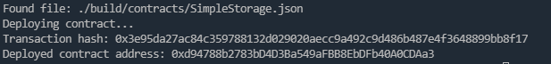

# Task 2: Deploy A Simple Ethereum Smart Contract On Polyjuice

## 1.A screenshot of the console output immediately after you have successfully deployed a smart contract.

## 2.The transaction hash from the contract deployment (in text format).

Transaction hash: 0x3e95da27ac84c359788132d029020aecc9a492c9d486b487e4f3648899bb8f17

## 3.The deployed contract address from the contract deployment (in text format).

Deployed contract address: 0xd94788b2783bD4D3Ba549aFBB8EbDFb40A0CDAa3
