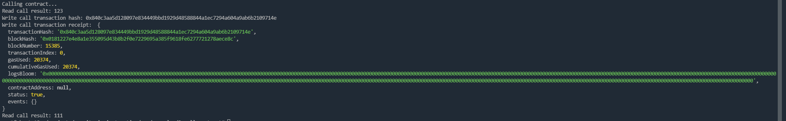

# Gitcoin: 3) Issue A Smart Contract Call To The Deployed Smart Contract

## 1.A screenshot of the console output immediately after you have successfully issued a smart contract call.



## 2.The transaction hash from the console output (in text format).

0x840c3aa5d128097e834449bbd1929d48588844a1ec7294a604a9ab6b2109714e

## 3.The contract address that you called (in text format).

0xd94788b2783bD4D3Ba549aFBB8EbDFb40A0CDAa3

## 4.The contract address that you called (in text format).

``` 
[
    {
      "inputs": [],
      "stateMutability": "payable",
      "type": "constructor"
    },
    {
      "inputs": [
        {
          "internalType": "uint256",
          "name": "x",
          "type": "uint256"
        }
      ],
      "name": "set",
      "outputs": [],
      "stateMutability": "payable",
      "type": "function"
    },
    {
      "inputs": [],
      "name": "get",
      "outputs": [
        {
          "internalType": "uint256",
          "name": "",
          "type": "uint256"
        }
      ],
      "stateMutability": "view",
      "type": "function"
    }
  ]
  ```
