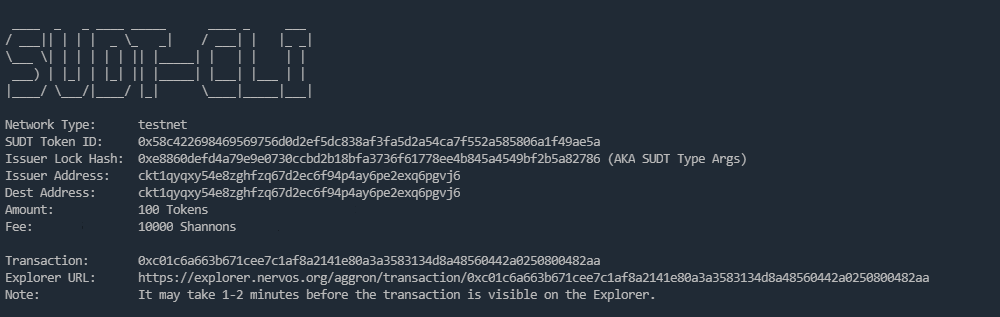
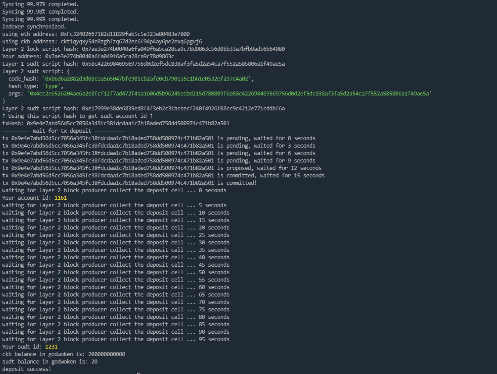

# Gitcoin: 4) Issue An SUDT Token On Layer 1 And Deposit It To Layer 2

## 1.A link to the Layer 1 address you funded on the Testnet Explorer.
https://explorer.nervos.org/aggron/address/ckt1qyqxy54e8zghfzq67d2ec6f94p4ay6pe2exq6pgvj6

## 2.A screenshot of the console output immediately after using sudt-cli to create your SUDT tokens on Layer 1.

## 3.A link to the transaction ID created by sudt-cli on the Testnet Explorer.

Explorer URL:      https://explorer.nervos.org/aggron/transaction/0xc01c6a663b671cee7c1af8a2141e80a3a3583134d8a48560442a0250800482aa

## 4.A screenshot of the console output immediately after you have successfully submitted a deposit to Layer 2 using the account-cli tool.

## 5.The SUDT ID from the console output after executing the deposit script (in text format).

SUDT ID: 1231
