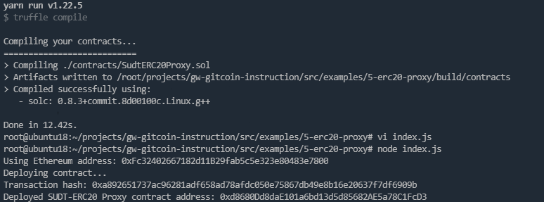
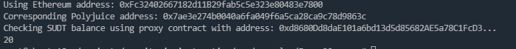

# Gitcoin: 5) Deploy The ERC20 Proxy Contract For The Deposited SUDT

## 1.A screenshot of the console output immediately after deploying smart contract.

## 2.The address of the ERC20 Proxy Contract you deployed (in text format).

Deployed SUDT-ERC20 Proxy contract address: 0xd8680Dd8daE101a6bd13d5d85682AE5a78C1FcD3

## 3.A screenshot of the console output immediately after checking your SUDT balance.

## 4.The Ethereum address that was checked (in text format).

0xFc32402667182d11B29fab5c5e323e80483e7800
