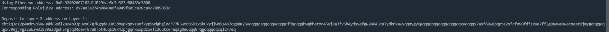

# Gitcoin: 6) Use Force Bridge To Deposit Tokens From Ethereum To Polyjuice

## 1.A screenshot of the console output immediately after you have successfully generated your Deposit Receiver Address.

## 2.Your Deposit Receiver Address (in text format).

ckt1q3dz2p4mdrvp5ywu4kk5edl2uc4p03puvx07g7kgqdau3n3dmypkqnxzuefxyp9wdghglncj77k5wt6p59sx6kukyjlwh5s467qgp8m25yqqqqqsqqqqqvqqqqqfjqqqqqhwgkhetmr45uj8a3fv5h4ydsyefgw24045ca7ydknkawxqqnygy6gqqqqpqqqqqqcqqqqqxyqqqqx7asf60w8pqpte2sfcfn90fdfzxue7ff2g8sawe9wacnqat6jmygqngqqqqpxv9ejjvgz2u63w3l839aadguh5rgtqd4devf97a0fpt4uqsz0k4lpjgqnxwxpdzxefl26utceraqzg8euqqq9rqgqqqqqqcql2r7eq

## 3.The Ethereum address used to generate the Deposit Receiver Address (in text format).

0xFc32402667182d11B29fab5c5e323e80483e7800

## 4.A link to the Etherscan explorer for the successful Force Bridge transaction. This can be found on Force Bridge under History→Succeed.

https://rinkeby.etherscan.io/tx/0x797c9239f6525e983fd20c5222bed7db9926996aee1dcca93b781ca55be3ef4b

## 5.A link to the Nervos explorer for the successful Force bridge transaction. This can be found on Force Bridge under History→Succeed.

https://explorer.nervos.org/aggron/transaction/0x79f48ea3db70ee56043c6f738e252c25e7c8f928af791b447bcccab3cae48236
