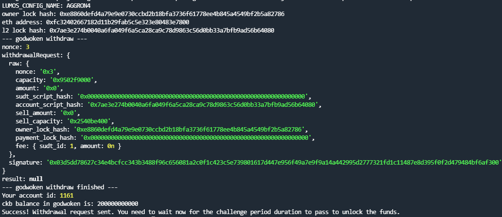

# Gitcoin: 9) Initiate Withdrawal Process From The Layer 2 Back To Layer 1

## 1.A screenshot of the console output immediately after running the withdraw command.

## 2.The Ethereum address that you've used for your Layer 2 account (in text format).

0xFc32402667182d11B29fab5c5e323e80483e7800

## 3.The Nervos Layer 1 address that you passed to withdraw command (in text format).

ckt1qyqxy54e8zghfzq67d2ec6f94p4ay6pe2exq6pgvj6

